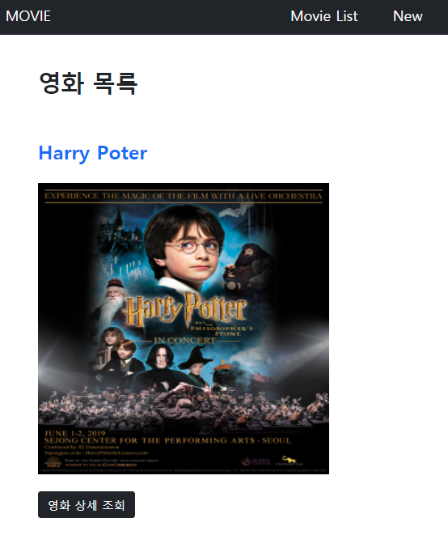

# :boom: Project

---


**반복 학습으로 Django의 벽을 조금은 넘은 기분**

Django 를 처음 시작했을 땐, 너무 짧은 시간에 많은 양을 배워서 그런지 너무나 힘들었다.

하지만, 스스로 복습의 시간을 갖고, 교수님들이 반복하여 같은 내용을 학습시켜 주셔서 

전체적인 Django의 흐름을 이해할 수 있었고, 이번 프로젝트를 만족스럽게 완성할 수 있었다.

프로젝트를 진행하면서, 수업시간에 학습한 내용들을 많이 참고하며 진행했지만, 

지속적인 복습을 통해서 아무런 참고자료 없이 혼자서 프로젝트를 완성해보고싶다는 생각이 들었다. 

처음 시도한 페어링도 재미있었다.    

​					

​																			

​																	**< 첫 화면[Index.html] >**



### 1.INDEX

```python
	
     <a href=""class="text-decoration-none fs-2 fw-bold" >{{movie.title}}</a><br><br>
    <br><br>
    <a href="" type="button" class="btn btn-dark"class="text-decoration-none" >영화 상세 조회</a>
    <br><br><br><br>
    
```

​	첫 인덱스에 이미지를 삽입하는 게 처음이라 어려움이 있었다.

포스터 경로를 받아와서 img태그 내에서 style을 통해 사이즈를 조정하고 이미지를 삽입 할 수 있었다.

제목도 a태그를 통해 하이퍼링크, 폰트사이즈 등을 통해 작성 할 수 있었다.

​																												


​																						


### 2.DETAIL

```python

    </p>
    <p>작성일:{{movie.created_at}}</p>
    <p>수정일:{{movie.updated_at}}</p>
    <hr>
    <hr>
    <div class="d-flex flex-row">
    <a href="" class='btn btn-primary m-1'>편집</a>

    <form action="" method='POST'>
        
        <button class='btn btn-danger m-1'>삭제</button>
    </form>
    </div>  
    <br>
    <a href=""class='text-decoration-none'>영화 목록으로 돌아가기</a>
```

​	DETAIL 도 역시 사진을 삽입하는 부분이 있어서 주의했고, d-flew flex-row를 통해 편집과 삭제 버튼이

나란히 있을 수 있도록 조정하였다.

이외에는 크게 어려운 부분은 없었다.


### 3.Base.html

```python
    <nav class="navbar navbar-dark bg-dark navbar-light bg-light">
  <div class="container-fluid">
    <a class="navbar-brand" href="#">MOVIE</a>
    
      <ul class="nav" >
        <li class="nav-item">
          <a class="navbar-brand nav-link active" aria-current="page" href="">Movie List</a>
        </li>
        <li class="nav-item">
          <a class="navbar-brand nav-link active" aria-current="page" href="">New</a>
        </li>
      </ul>
    
  </div>
</nav>
```

 이번 프로젝트를 하면서 가장 크게 느낀 건, 지난 CSS, Bootstrap에 대한 중요성과 필요성이였다.

다른 프로젝트들을 하면서 필요하다고 생각되지만, 

아직 많이 미숙해서 CSS, Bootstrap 부분에서 시간을 많이 허비하였다.

Base.html에서도 Navbar를 원하는대로 만드는데 약간의 어려움이 있었다.

CSS, Bootstrap의 중요성을 체감했고, 복습해야 겠다는 생각이 들었다.

